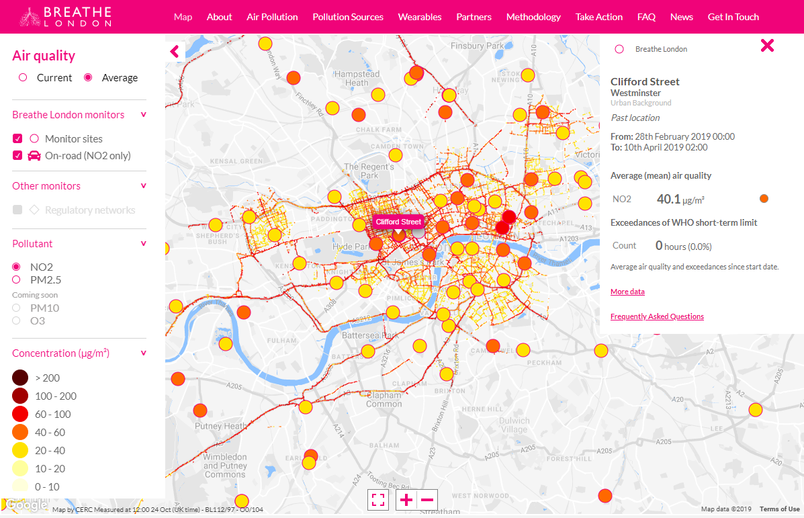
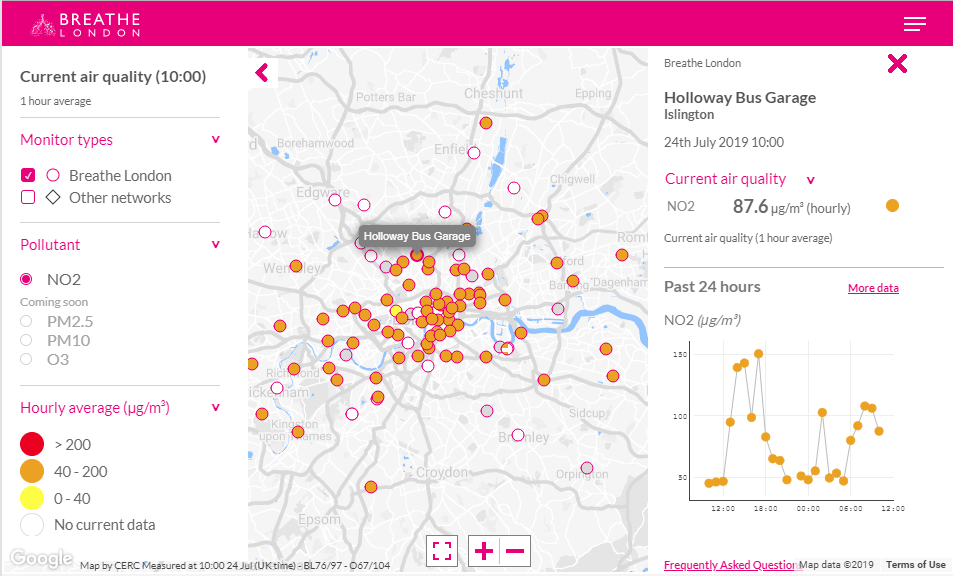

# Breathe London Web Platform
The web platform that provided the data, maps and visualisations for the Breathe London website under the Breathe London Pilot project.

## Breathe London Pilot Project
The Breathe London pilot project deployed 100 state-of-the-art fixed air quality sensor pods on lampposts and buildings close to known air quality hotspots and sensitive locations such as schools and nurseries. Two Google Street View cars equipped with air quality monitors took readings approximately every 30 metres at tens of thousands of locations while they travelled through London's streets. The data collected across the capital provided an unprecedented level of detail about London's air quality and delivered new insight into the sources of pollution.
The Breathe London pilot was funded by the [Clean Air Fund](https://www.cleanairfund.org/) and delivered by a consortium led by [Environmental Defense Fund Europe](https://www.edfeurope.org/) 
with partners including Google, University of Cambridge, CERC, ACOEM and NPL. The pilot Breathe London project was sponsored by City Hall, the [Children’s Investment Fund Foundation](https://ciff.org/) 
and [C40 Cities](https://www.c40.org/) – the leading global alliance of cities committed to addressing climate change.

## Web Platform
[CERC](https://cerc.co.uk/environmental-research/web-platforms.html) developed the web platform that provided the data, maps and visualisations for the Breathe London website. 
The platform uses the Google Cloud, which enables user-friendly performance when querying these large datasets to provide graphs and visualisations, 
and ensures the replicability and scalability of the platform to other cities around the world. 
The platform is capable of displaying near-real-time data from Breathe London's AQMesh sensors and also other monitor networks such as the London Air Quality Network.
The platform is open-source and so it is freely replicable by other cities around the world that wish to build their own platform.

## Screenshots
Some screenshots of the platform, showing measurements from the Google Street View cars and the static pods.

## Projects

There are two projects in this repository: *BreatheLondonNet* and *BreatheLondonInfo*.

### BreatheLondonNet
This was hosted under the breathelondon.net domain. It provided HTML, CSS, Javascript for the map page. The maps use Google Maps and the graphs used Plotly.js. The map page was included in the EDF project website at breathelondon.org through an IFrame.

### BreatheLondonInfo
This was hosted under the breathelondon.info domain. It is a Google AppEngine project to read the AQmesh sensor data from Google Cloud Platform Datastore. 

### People
There isn't space here to list everyone who contributed. Mark Jackson (CERC) was the architect. Chris Johnson (CERC) was the lead developer. Paul Ormandy (Punk My Pixel) was the UX designer. Thanks to the many colleagues from CERC, EDF, University of Cambridge and ACOEM who contributed to the web platform. Particular thanks to the EDF project managers: Elizabeth Fonseca, Felicia Douglas and Catherine Ittner.    

## Copyright
All code copyright Cambridge Environmental Research Consultants Ltd. 2022, and all rights reserved. With the exception of code for existing third-party libraries, which have been included in this repository for convenience when developing.
